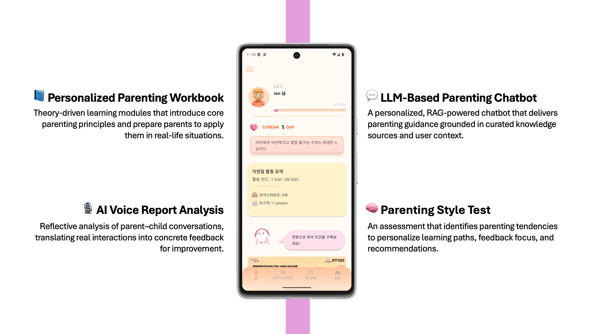

# ION


ION은 **예비 부모와 0~7세 자녀 부모를 위한 LLM·STT 기반 맞춤형 교육 및 연령별 부모교육 앱**으로,  
부모–아이 별 상황을 분석하여 **사용자 맞춤형 Workbook, 대화 분석 Voice Report, 양육 상담 Chatbot** 기능을 제공하는 서비스입니다.

본 레포지토리는 ION 캡스톤 프로젝트의 **Android 앱, Backend 서버, AI 모듈**을 포함합니다.


## 🔍 Project Overview

ION은 다음과 같은 문제의식에서 출발했습니다.

- 체계적인 부모 교육에 대한 **접근성 부족**
- 이론 위주의 교육으로 인한 **실제 상황 적용의 어려움**
- 부모·아이 상황에 맞춘 **개인화된 구체적 조언의 부재**

이를 해결하기 위해 ION은
- **학습 - 실천 - 상담**의 흐름을 하나의 모바일 서비스로 통합한
AI 기반 육아 지원 시스템을 구현했습니다.

ION은 다음 세가지 핵심 기능으로 구성됩니다.

## 📘 Workbook (학습 단계)
**연령·발달·성향에 맞춘 부모 교육 커리큘럼 제공**
* 출산 전부터 0–5세까지의 부모를 대상으로 한 단계별 부모교육 워크북
* 회원가입 시 입력한 자녀 연령, 성향, 부모 정보 등을 반영해 **개인화된 워크북 콘텐츠 자동 생성**
* 아동발달 이론 기반의:
* + 이론 설명 콘텐츠
  + 선택형/서술형 액티비티
  + 가상 아이와의 대화 시뮬레이션(상황제시형)
* 단순 정보 전달이 아닌, **생각해보고 연습해보는 학습 경험**에 초점 
→ 체계적인 부모 교육을 시간·장소 제약 없이 제공

## 🎙 Voice Report (실천 단계)
**부모–아이 실제 대화를 기반으로 한 행동 피드백 제공**
* 홈캠·녹음 등을 통해 수집한 **부모–아이 실대화 음성 데이터 분석**
* STT + 화자 분리(Diarization)를 통해 대화 구조를 분석하고,
* AI가 다음과 같은 항목에 대해 **행동 피드백 리포트 생성**
* + 언어적 반응 패턴
  + 감정 표현 방식
  + 부적절한 표현에 대한 대체 표현 제안
  + 긍정적 양육 행동 포인트
  + 부모-아이 발화 비율
→ 이론에서 배운 내용을 **실제 양육 상황에서 어떻게 적용하고 있는지 명확하게 확인 가능**

## 💬 Parenting Chatbot (상담 단계)
**24시간 즉각적인 개인 맞춤형 육아 상담 지원**
* 사용자의 질문에 대해:
* + 회원가입 시 입력한 사용자·자녀 특성
  + 신뢰 가능한 육아 전문 자료
  를 종합하여 **상황 맥락을 고려한 답변 제공**
* 단순 일반 답변이 아닌, **부모 상황에 맞춘 비교적 구체적인 조언** 제공
* 육아 전문가 상담이나 오프라인 교육의:
* + 긴 대기 시간
  + 높은 비용
  + 접근성 한계를 보완
→ **언제든지 접근 가능한 육아 상담 창구 역할**

## 🎥 Demo Video
👉 [Watch Demo Video](https://github.com/Juhyuns0n/ION/releases/tag/demo)

## 🧩 System Components

### 📱 Android Application
- 사용자 인증
- 부모 교육 워크북 제공
- Voice Report 및 분석 결과 시각화
- 챗봇 상담 UI 제공
- 📌 Android 관련 상세 내용은 `android/` 디렉토리를 참고하세요.

### 🖥 Back-end Server
- 사용자 및 도메인 데이터 관리
- Voice Report / Workbook / Chatbot API 제공
- MySQL(RDS) 기반 데이터 영속화
- AI 마이크로서비스 연동
- 📌 Server 관련 상세 내용은 `backend/` 디렉토리를 참고하세요.

### 🤖 AI Module
- 음성·텍스트 기반 상호작용 분석
- 피드백 및 교육 콘텐츠 생성
- 백엔드 서버와 REST API 기반 연동
- 📌 AI 관련 상세 내용은 `ai/` 디렉토리를 참고하세요.

---

## 📂 Repository Structure

```text
ION/
├── android/        # Android Application (APK 포함)
├── backend/        # Spring Boot Back-end Server
├── ai/             # AI 분석 모듈 (Python)
├── docs/           # 프로젝트 보고서
├── README.md       # Root README
└── .gitignore

```
---
## 🧱 Prerequisites (실행 환경)

- **Android**: Android Studio, JDK 17+
- **Back-end**: Java 21, Gradle 8.x, MySQL 8.x
- **AI module**: Python 3.x

본 프로젝트는 캡스톤 제출용으로 개발되었으며,  
시연 이후 서버가 **offline 상태**이므로 전체 End-to-End 실행은 제한될 수 있습니다.

---

## 🛠 How to build

### 📱 Android
```bash
cd android
./gradlew assembleDebug
```
> ℹ️ Android SDK 경로는 각 개발 환경에 따라 다르므로
> `local.properties` 파일은 repository에 포함되어 있지 않습니다.
> Android Studio에서 프로젝트를 열면 자동으로 설정됩니다.


### 🖥 Back-end
```bash
cd backend
./gradlew build
```
### 🤖 AI module
- 의존성 설치 및 실행 방법은 `ai/README.md`를 참고하세요.

---

## 📦 How to install / run

### 📱 Android
- **APK 설치 (권장)**  
  https://github.com/Juhyuns0n/ION/releases/tag/v1.0

- 개발용 빌드 및 실행 방법은 `android/` 디렉토리를 참고하세요.  
  👉 세부 안내: https://github.com/Juhyuns0n/ION/tree/main/android

### 🖥 Back-end
```bash
cd backend
./gradlew bootRun
```
- Back-end 설정 및 실행 환경에 대한 상세 내용은 backend/ 디렉토리를 참고하세요.
  👉 세부 안내: https://github.com/Juhyuns0n/ION/tree/main/backend

### 🤖 AI module
- 로컬 실행 방법 및 연동 방식은 `ai/` 디렉토리를 참고하세요.

---

## ✅ How to test

### 🖥 Back-end
- Back-end 기능은 API 호출 기반으로  
  **클라이언트(Android 앱) 연동 시나리오를 통해 수동으로 검증**되었습니다.
- 주요 API(회원 관리, 워크북, Voice Report, Chatbot)는  
  실제 요청/응답 흐름을 기준으로 정상 동작 여부를 확인했습니다.

---

### 📱 Android
- 본 프로젝트는 서비스 특성상 **자동화된 테스트 코드(Unit/UI Test)** 보다는  
  **실제 사용자 시나리오 기반의 수동 테스트(Manual / Exploratory Testing)** 를 중심으로 검증되었습니다.
- 회원가입, 로그인, 워크북 학습, Voice Report 조회, 챗봇 상담 등  
  **주요 사용자 플로우를 직접 실행하며 기능 정상 동작 여부를 확인**하였습니다.
- 테스트는 실제 Android 기기 및 Android Studio 실행 환경에서 진행되었습니다.

- Android 빌드/실행 관련 세부 내용은 아래를 참고하세요.  
  👉 https://github.com/Juhyuns0n/ION/tree/main/android

---

> ⚠️ **주의**  
> 백엔드 서버 및 AI 연동은 시연 이후 **offline 상태**이므로  
> 전체 End-to-End(E2E) 테스트는 현재 시점에서 제한될 수 있습니다.

---

## 📚 Open Source & External Services

ION은 다음 오픈소스 및 외부 서비스를 활용합니다.

- **OpenAI API** – LLM 기반 응답 생성
- **Whisper** – Speech-to-Text (STT)
- **pyannote** – Speaker Diarization
- **KR-SBERT** – 임베딩 기반 유사도 검색
- Android / Spring Boot / MySQL 표준 프레임워크

세부 의존성 및 설정은 각 모듈의 README 및 설정 파일을 참고하세요.

---

## 📱 How to build (세부 안내)

- **Android**  
  👉 https://github.com/Juhyuns0n/ION/tree/main/android

- **Back-end Server**  
  👉 https://github.com/Juhyuns0n/ION/tree/main/backend

