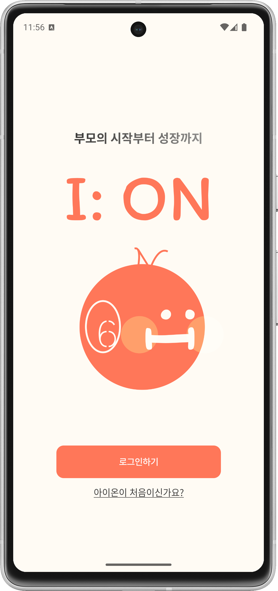

# ION Android Application

ION Android 앱은 부모 교육 콘텐츠 제공, 부모–자녀 대화 분석 결과 조회,  
그리고 AI 기반 챗봇 상담 기능을 담당하는 **클라이언트 애플리케이션**입니다.

본 애플리케이션은 ION 캡스톤 프로젝트의 Android Front-End로서,
백엔드 서버 및 AI 분석 모듈과 연동되어 사용자 맞춤형 육아 지원 경험을 제공합니다.

---

## 📱 주요 기능

- **사용자 회원가입 및 로그인**
  - 회원가입 시 부모 성향 테스트를 포함하여 사용자 특성을 수집합니다.

- **부모 교육 워크북 콘텐츠 제공**
  - 전문 육아 서적 기반 콘텐츠와 사용자 개인화 요소를 결합한 워크북을 제공합니다.
  - 단계별 학습 및 실천 중심의 인터랙션을 지원합니다.

- **Voice Report 분석 결과 조회**
  - 사용자가 업로드한 부모–자녀 대화 영상/음성 데이터를 기반으로
    AI 분석 결과 및 피드백을 시각화하여 제공합니다.

- **AI 챗봇 상담 UI 제공**
  - 육아 상담을 위한 AI 챗봇 인터페이스를 제공합니다.
  - 과거 상담 내역 조회 기능을 지원합니다.

- **백엔드 API 연동**
  - 사용자 상태, 보상, 분석 결과 등 모든 데이터는
    백엔드 API 연동을 통해 조회 및 관리됩니다.

---

## 🧪 테스트 환경

- **테스트 기기**: Android 스마트폰
- **Minimum SDK**: Android 9 (API 28)
- **Target / Compile SDK**: API 35 (Android 15)

---

## 📦 APK 설치 안내

### 1️⃣ APK 다운로드
- GitHub Release 페이지에서 APK 파일 다운로드

👉 **APK 다운로드 링크**  
https://github.com/Juhyuns0n/ION/releases/tag/v1.0

### 2️⃣ 출처를 알 수 없는 앱 설치 허용
APK 설치를 위해 안드로이드 기기 설정이 필요합니다.

**방법 1**
- [설정] → [보안 및 개인정보 보호]
- [보안 위험 자동 차단] → *사용 안 함*
- APK 설치 시 “출처를 알 수 없는 앱 설치” → **허용**

**방법 2**
- [설정] → [보안 및 개인정보 보호]
- [기타 보안 설정] → [출처를 알 수 없는 앱 설치]
- Chrome / 삼성 인터넷 등 다운로드 앱 허용

> 기종 및 Android 버전에 따라 메뉴 명칭은 다를 수 있습니다.

---

## 🔐 테스트 계정 안내

> ⚠️ 현재 백엔드 서버는 시연 완료 후 **offline 상태**입니다.

- **ID**: IOnUserTest1117@naver.com  
- **PW**: IOnUser!

테스트 계정을 활용한 기능 시연은 **수업 시간 중 완료**되었습니다.

---

## 🌐 Network Information

- **Base URL**: http://3.38.149.207:8080/
- 현재 서버는 종료된 상태입니다.

---

## 🛠 Build Information

- **Build Type**: Debug APK
- Debug APK 특성상 Play Protect 경고가 표시될 수 있습니다.

---

## 🧩 Related Modules

- Back-End Server: `backend/`
- AI Analysis Module: `ai/`

각 모듈의 상세 설명은 해당 디렉토리의 README를 참고하세요.

--- 

## 📌 Notes

- 본 애플리케이션은 **캡스톤 디자인 수업 제출용**으로 개발되었습니다.
- 백엔드 서버는 수업 시연 완료 후 종료(off-line)된 상태입니다.
- APK는 설치 및 UI 구조 확인 목적의 실행 파일로 제공됩니다.
